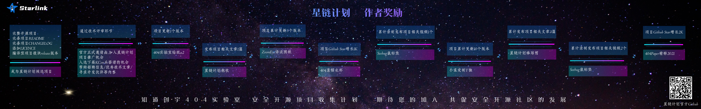

## 404星链计划 / 404 StarLink Project

<div align="center">

</div>

「404星链计划」是知道创宇 404 实验室于 2020 年 8 月开始的计划，主要目的是改善安全圈内工具庞杂、水平层次不齐、开源无人维护的多种问题，促进安全开源社区的发展；通过这种方式将不同安全领域研究人员与开源项目链接起来。

星链计划将不断地收集优秀的安全开源项目，对收录的项目提供技术支持，持续跟踪和展示项目的更新和动态，并建立了星链计划社区，社区用户可以通过星链展示板块探索自己感兴趣的项目，同时还可以在社区内快速为开源作者反馈问题。以此方式帮助开源项目成长，促进安全社区发展。


## 展示/Exhibition
<!--auto_index_exhibition_begin_5ffbdd274903479a5d958dd90847b2de-->

**1.项目动态**

| 时间 | 项目名称 | 项目动态 |
|----|-----------|--------------------------|
|2021-10-31|[**Viper**](detail/Viper.md)|更新 [v1.5.6](detail/Viper.md#最近更新) 版本|
|2021-10-22|[**HaE**](detail/HaE.md)|更新 [v2.1.2](detail/HaE.md#最近更新) 版本|
|2021-10-03|[**f8x**](detail/f8x.md)|更新 [v1.5.6](detail/f8x.md#最近更新) 版本|
|2021-10-02|[**CDK**](detail/CDK.md)|更新 [v1.0.4](detail/CDK.md#最近更新) 版本|
|2021-08-27|[**antSword**](detail/antSword.md)|更新 [v2.1.15](detail/antSword.md#最近更新) 版本|
|2021-08-17|[**MDUT**](detail/MDUT.md)|更新 [v2.0.6](detail/MDUT.md#最近更新) 版本|
|2021-07-02|[**Pocassist**](detail/Pocassist.md)|Pocassist加入星链计划|
|2021-07-02|[**MDUT**](detail/MDUT.md)|MDUT加入星链计划|
|2021-07-02|[**OpenStar**](detail/OpenStar.md)|OpenStar加入星链计划|
|2021-07-02|[**Stowaway**](detail/Stowaway.md)|Stowaway加入星链计划|

**2.StarRank**

| 序号 | 项目名称 | 项目简介 | Star |
|----|-----------|--------------------------|----|
|1|[**HackBrowserData**](detail/HackBrowserData.md)|hack-browser-data 是一个解密浏览器数据（密码/历史记录/Cookies/书签）的导出工具，支持全平台主流浏览器的数据导出窃取。|3700|
|2|[**fscan**](detail/fscan.md)|一款内网综合扫描工具，方便一键自动化、全方位漏扫扫描。支持主机存活探测、端口扫描、常见服务的爆破、ms17010、redis批量写公钥、计划任务反弹shell、读取win网卡信息、web指纹识别、web漏洞扫描、netbios探测、域控识别等功能。|2500|
|3|[**CDK**](detail/CDK.md)|CDK是一款为容器环境定制的渗透测试工具，在已攻陷的容器内部提供零依赖的常用命令及PoC/EXP。集成Docker/K8s场景特有的逃逸、横向移动、持久化利用方式，插件化管理。|1800|
|4|[**Viper**](detail/Viper.md)|VIPER是一款图形化内网渗透工具,将内网渗透过程中常用的战术及技术进行模块化及武器化。|1700|
|5|[**Kunpeng**](detail/Kunpeng.md)|Kunpeng是一个Golang编写的开源POC检测框架，集成了包括数据库、中间件、web组件、cms等等的漏洞POC，可检测弱口令、SQL注入、XSS、RCE等漏洞类型，以动态链接库的形式提供调用，通过此项目可快速开发漏洞检测类的系统，比攻击者快一步发现风险漏洞。|1400|
|6|[**antSword**](detail/antSword.md)|中国蚁剑是一款开源的跨平台网站管理工具。|1100|
|7|[**OpenStar**](detail/OpenStar.md)|OpenStar 是一个基于 OpenResty 的高性能 Web 应用防火墙，支持复杂规则编写。提供了常规的 HTTP 字段规则配置，还提供了 IP 黑白名单、访问频次等配置，对于 CC 防护更提供的特定的规则算法，并且支持搭建集群进行防护。|996|
|8|[**ServerScan**](detail/ServerScan.md)|一款使用Golang开发且适用于攻防演习内网横向信息收集的高并发网络扫描、服务探测工具。|949|
|9|[**Stowaway**](detail/Stowaway.md)|Stowaway 是一款多级代理工具，可将外部流量通过多个节点代理至内网，突破内网访问限制。Stowaway 可以方便渗透测试人员通过多级跳跃，从外部dmz等一系列区域逐步深入核心网络；Stowaway 除了流量转发功能，还提供了端口复用、ssh隧道，流量伪装等专为渗透测试人员所用的功能。|875|
|10|[**Elkeid**](detail/Elkeid.md)|Elkeid是一个云原生的基于主机的安全(入侵检测与风险识别)解决方案。Elkeid 包含两大部分：Elkeid Agent与Elkeid Driver作为数据采集层，它在Linux系统的内核和用户空间上均可使用，从而提供了具有更好性能的且更丰富的数据。 Elkeid Server可以提供百万级Agent的接入能力，采集Agent数据，支持控制与策略下发。包含实时、离线计算模块，对采集上来的数据进行分析和检测。又有自带的服务发现和管理系统，方便对整个后台管理和操作。|860|

**3.项目更新**

| 时间 | 项目迭代版本 |
|----|-----------|
|第43周|[**Viper**](detail/Viper.md) 更新 [v1.5.6](detail/Viper.md#最近更新)|
|第42周|[**HaE**](detail/HaE.md) 更新 [v2.1.2](detail/HaE.md#最近更新) / **[Viper](https://github.com/FunnyWolf/Viper)** 更新 [v1.5.5](detail/Viper.md#最近更新)|
|第41周|[**Viper**](detail/Viper.md) 更新 [v1.5.4](detail/Viper.md#最近更新)|
|第40周|[**Viper**](detail/Viper.md) 更新 [v1.5.3](detail/Viper.md#最近更新)|
|第39周|[**CDK**](detail/CDK.md) 更新 [v1.0.4](detail/CDK.md#最近更新) / **[f8x](https://github.com/ffffffff0x/f8x)** 更新 [v1.5.6](detail/f8x.md#最近更新)|
|第38周|[**Viper**](detail/Viper.md) 更新 [v1.5.1](detail/Viper.md#最近更新)|
|第37周|[**Viper**](detail/Viper.md) 更新 [v1.5.0](detail/Viper.md#最近更新)|
|第34周|[**Viper**](detail/Viper.md) 更新 [v1.4.1](detail/Viper.md#最近更新) / **[antSword](https://github.com/AntSwordProject/antSword)** 更新 [v2.1.15](detail/antSword.md#最近更新)|
|第33周|[**Viper**](detail/Viper.md) 更新 [v1.4.0](detail/Viper.md#最近更新) / **[MDUT](https://github.com/SafeGroceryStore/MDUT)** 更新 [v2.0.6](detail/MDUT.md#最近更新)|

**4.新项目加入**

| 时间 | 项目名称 | 项目简介 |
|----|-----------|--------------------------|
|2021-07-02|[**Pocassist**](detail/Pocassist.md)|Pocassist 是一个 Golang 编写的全新开源漏洞测试框架，帮助安全人员专注于漏洞验证的逻辑的实现。Pocassist 提供了简洁的 Web 图形化界面，用户可以在线编辑漏洞验证程序即可进行批量的测试；规则完全兼容 xray，可以直接使用现有开源的 PoC 库，同时也支持添加自定义规则。|
|2021-07-02|[**MDUT**](detail/MDUT.md)|MDUT 全称 Multiple Database Utilization Tools，旨在将常见的数据库利用手段集合在一个程序中，打破各种数据库利用工具需要各种环境导致使用相当不便的隔阂；MDUT 使用 Java 开发，支持跨平台使用。|
|2021-07-02|[**OpenStar**](detail/OpenStar.md)|OpenStar 是一个基于 OpenResty 的高性能 Web 应用防火墙，支持复杂规则编写。提供了常规的 HTTP 字段规则配置，还提供了 IP 黑白名单、访问频次等配置，对于 CC 防护更提供的特定的规则算法，并且支持搭建集群进行防护。|
|2021-07-02|[**Stowaway**](detail/Stowaway.md)|Stowaway 是一款多级代理工具，可将外部流量通过多个节点代理至内网，突破内网访问限制。Stowaway 可以方便渗透测试人员通过多级跳跃，从外部dmz等一系列区域逐步深入核心网络；Stowaway 除了流量转发功能，还提供了端口复用、ssh隧道，流量伪装等专为渗透测试人员所用的功能。|
|2021-07-02|[**Platypus**](detail/Platypus.md)|Platypus 是一个基于终端与 Web UI 交互式的反弹 Shell 会话管理工具。在实际的渗透测试中，为了解决 Netcat/Socat 等工具在文件传输、多会话管理方面的不足。该工具在多会话管理的基础上增加了在渗透测试中更加有用的功能，可以更方便灵活地对反弹 Shell 会话进行管理。|
|2021-04-22|[**fscan**](detail/fscan.md)|一款内网综合扫描工具，方便一键自动化、全方位漏扫扫描。支持主机存活探测、端口扫描、常见服务的爆破、ms17010、redis批量写公钥、计划任务反弹shell、读取win网卡信息、web指纹识别、web漏洞扫描、netbios探测、域控识别等功能。|
|2021-04-22|[**Elkeid**](detail/Elkeid.md)|Elkeid是一个云原生的基于主机的安全(入侵检测与风险识别)解决方案。Elkeid 包含两大部分：Elkeid Agent与Elkeid Driver作为数据采集层，它在Linux系统的内核和用户空间上均可使用，从而提供了具有更好性能的且更丰富的数据。 Elkeid Server可以提供百万级Agent的接入能力，采集Agent数据，支持控制与策略下发。包含实时、离线计算模块，对采集上来的数据进行分析和检测。又有自带的服务发现和管理系统，方便对整个后台管理和操作。|
|2021-04-22|[**As-Exploits**](detail/As-Exploits.md)|中国蚁剑后渗透框架|
|2021-03-23|[**Viper**](detail/Viper.md)|VIPER是一款图形化内网渗透工具,将内网渗透过程中常用的战术及技术进行模块化及武器化。|
|2021-03-23|[**CodeReviewTools**](detail/CodeReviewTools.md)|CodeReviewTools是一个可以快速批量反编译jar包的工具，为审计Java代码做好第一步。|

**5.[分类:甲方工具](party_a.md)**

| 序号 | 项目名称 | 作者 | 项目简介 | Star |
|------|----------|------|----------|------|
|1|[**Elkeid**](detail/Elkeid.md)|bytedance|Elkeid是一个云原生的基于主机的安全(入侵检测与风险识别)解决方案。Elkeid 包含两大部分：Elkeid Agent与Elkeid Driver作为数据采集层，它在Linux系统的内核和用户空间上均可使用，从而提供了具有更好性能的且更丰富的数据。 Elkeid Server可以提供百万级Agent的接入能力，采集Agent数据，支持控制与策略下发。包含实时、离线计算模块，对采集上来的数据进行分析和检测。又有自带的服务发现和管理系统，方便对整个后台管理和操作。|860|
|2|[**linglong**](detail/linglong.md)|awake1t|linglong是一款甲方资产巡航扫描系统。系统定位是发现资产，进行端口爆破。帮助企业更快发现弱口令问题。主要功能包括: 资产探测、端口爆破、定时任务、管理后台识别、报表展示。|826|
|3|[**gshark**](detail/gshark.md)|madneal|一款开源敏感信息监测系统，可以监测包括 github、gitlab(目前不太稳定，由于gitlab对于免费用户不提供代码全文检索API)、searchcode 多平台的敏感信息监测。|421|
|4|[**Juggler**](detail/Juggler.md)|C4o|一个也许能骗到黑客的系统，可以作为WAF等防护体系的一环。|354|

**6.[分类:信息收集](reconnaissance.md)**

| 序号 | 项目名称 | 作者 | 项目简介 | Star |
|------|----------|------|----------|------|
|1|[**HaE**](detail/HaE.md)|gh0stkey|HaE是一款可以快速挖掘目标指纹和关键信息的Burp插件。|708|
|2|[**DarkEye**](detail/DarkEye.md)|zsdevX|基于go完成的渗透测试信息收集利器|688|
|3|[**Glass**](detail/Glass.md)|s7ckTeam|Glass是一款针对资产列表的快速指纹识别工具，通过调用Fofa/ZoomEye/Shodan/360等api接口快速查询资产信息并识别重点资产的指纹，也可针对IP/IP段或资产列表进行快速的指纹识别。|455|
|4|[**ZoomEye-go**](detail/ZoomEye-go.md)|gyyyy|ZoomEye-go 是一款基于 ZoomEye API 开发的 Golang 库，提供了 ZoomEye 命令行模式，同时也可以作为SDK集成到其他工具中。该库可以让技术人员更便捷地搜索、筛选、导出 ZoomEye 的数据。|27|

**7.全部分类**

* [甲方工具](party_a.md)
* [信息收集](reconnaissance.md)
* [漏洞探测](vulnerability_assessment.md)
* [攻击与利用](penetration_test.md)
* [信息分析](information_analysis.md)
* [内网工具](intranet_tools.md)
* [其他](others.md)

8.[入选2021Kcon安全会议兵器谱](column/2021KCon_exhibition_with_starlink.md)  
9.[星链计划全部项目](allprojects.md)  
10.[正在申请加入的项目](https://github.com/knownsec/404StarLink2.0-Galaxy/issues)  

<!--auto_index_exhibition_end_bb3ccc282a0d1924df21437a263718c3-->


## 加入/Join
开源作者可以通过提交 issue 申请加入星链计划，星链计划除了提供技术支持，还准备了各种里程碑奖励。

<div align="center">

</div>

[奖品实物一览](Images/milestone_prizes.png)

**1.提交申请**  
开源作者可以通过 <https://github.com/knownsec/404StarLink2.0-Galaxy/issues> 提交申请，申请规范如下：

```
### 项目名称
	
### 项目链接

### 项目简介

### 项目特点、亮点
```

提交申请后可以通过文末的联系方式添加星链运营微信账号，备注为「项目名称+星链计划」，运营小姐姐将协助你完成项目审核，以及进行后续的各类沟通。

**2.项目规范审核**  
申请提交后，星链运营对项目的基础规范进行审核，基础规范包括：

```
1. README.md (包括但不限于：项目简介、运行环境搭建、运行示例等)
2. CHANGELOG (记录项目更新)
3. LICENCE (为避免开源纠纷，需要提前选择开源协议)
4. 编译型项目需提供 RELEASE 版本
5. 项目需要和安全相关
6. 必须是完整的开源项目(不能是二进制文件，或部分开源)
```

**3.技术审核**  
项目通过基础规范审核后，将由星链评审组对项目进行技术审核，包括但不限于：

```
1. 项目属于计算机安全范畴
2. 项目完整开源
3. 项目源码内不包含恶意代码
4. 项目具有一定的实用价值
5. 项目可以正常部署和使用
6. etc
```

**4.发放邀请函**  
项目通过基础规范审核和技术审核后，由星链计划发送官方邀请函邮件到开源作者，邀请其正式加入星链计划。随后星链计划将持续跟踪项目动态，并按里程碑为开源作者发放礼品。

>开源作者收到星链计划邀请函后，希望开源作者可以添加 [星链计划 Banner](./banner.md) 到项目 README 的末尾，这样可以极大增加星链计划的影响力。


## 交流/Community
加入星链计划交流群，获取星链计划资讯，与开源作者互动起来吧。微信群请先添加星链运营个人账号，并备注「星链计划」，然后会把大家拉到星链计划交流群中。

<div align="center">

</div>