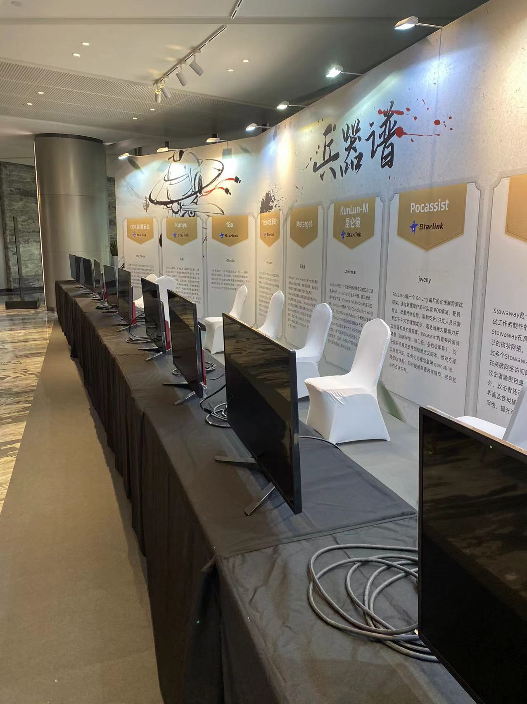
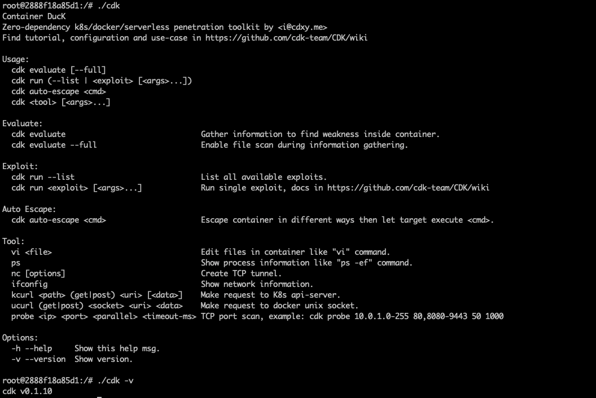
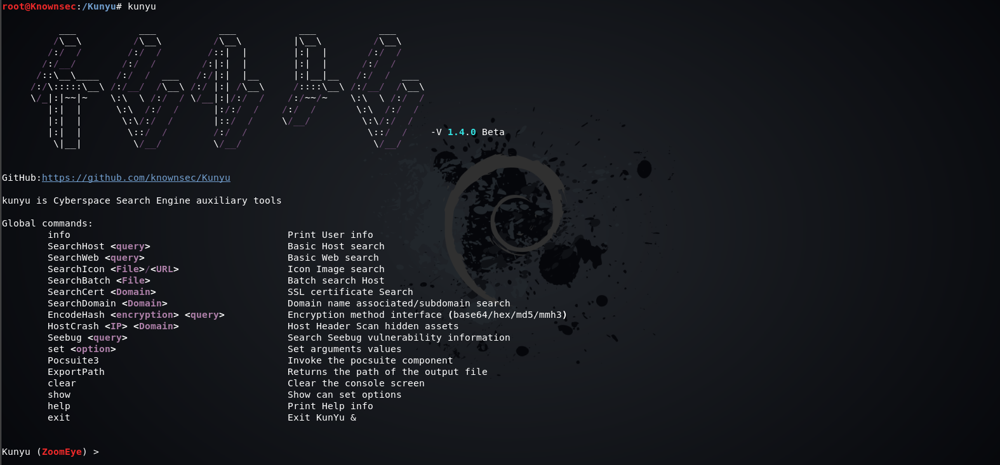
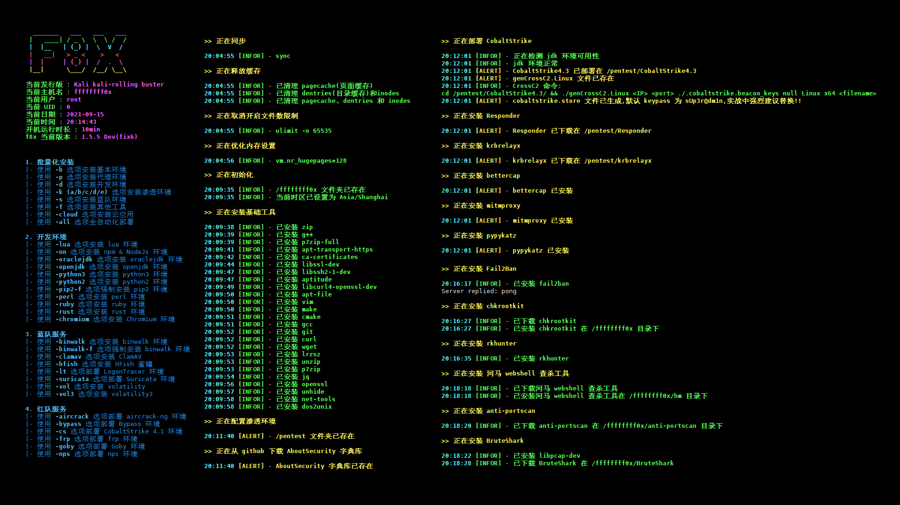
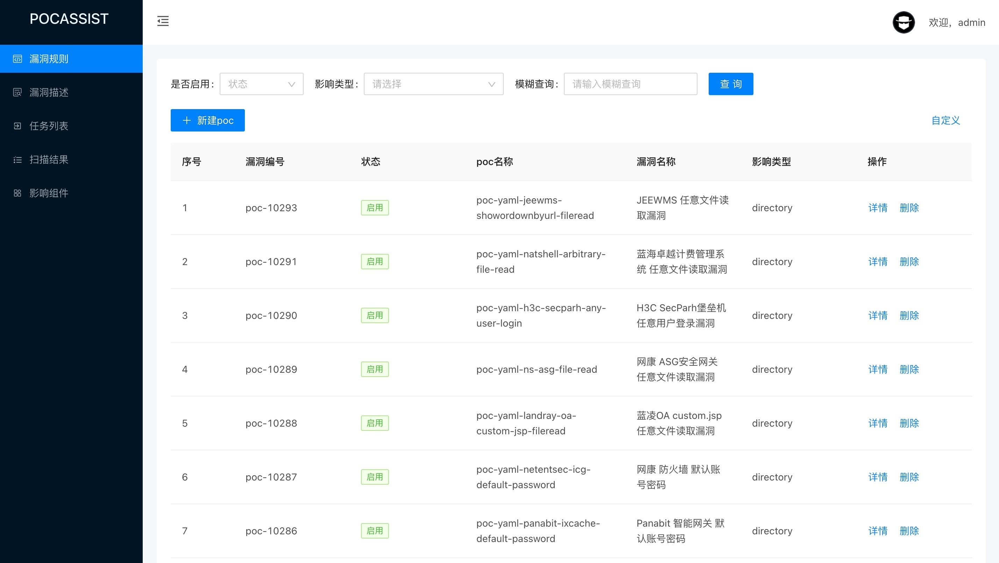
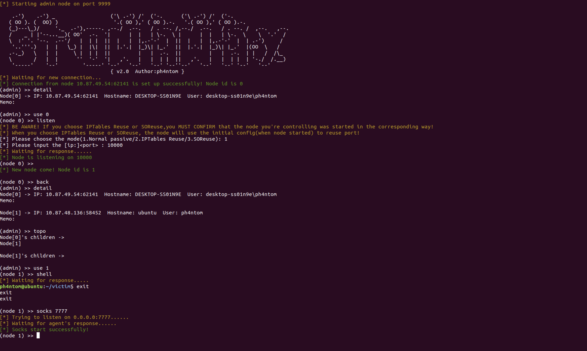
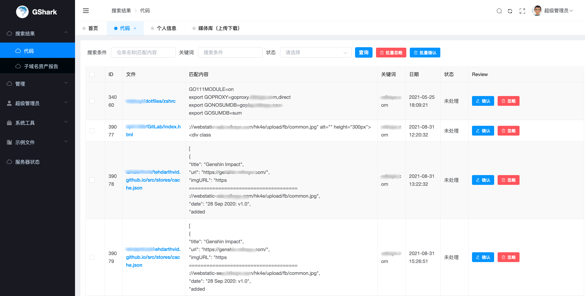

## 入选2021Kcon安全会议兵器谱

KCon 黑客大会由知道创宇主办，秉持着追求干货、乐于分享的精神，力求为每一位热爱黑客技术研究的伙伴打造一个尽情展示、互动交流的创意舞台。如今，历经十年打磨，KCon 黑客大会已成长为国际网络安全圈极富活力与影响力的前沿网络安全攻防技术交流平台。本届 KCon 选择以“纵横”为主题，十之一纵一横，包罗万象，正如网络空间的攻与防，变幻莫测。而纵横之下的这场网安论道，将以打造全球性网安交流平台为发展目标，加速强化中国网安力量。

详情可以访问: <http://kcon.knownsec.com/2021/#/>

为了鼓励国内安全自动化工具的发展，展示更多黑客及安全人员们的安全自动化研究成果，自 2016年 起，KCon 黑客大会便引入「兵器谱」展示环节。过去几届 KCon 黑客大会现场，已有三十多件“安全神兵利器”受到千余名参会黑客的观摩与试用，并获得媒体朋友们的广泛关注。

今年，在历时两个多月的招募与评选后，我们精心为大家挑选出了 11 件安全江湖的“神兵利器”，将于 KCon 现场尽情探索与展示！

详情可以访问: <http://kcon.knownsec.com/2021/#/arsenal>

在今年的兵器谱中，星链计划有大量的项目内推投稿到兵器谱，其中有 8 件安全江湖的“神兵利器”入选，他们是：

* [CDK](#cdk)
* [Kunyu](#kunyu)
* [f8x](#f8x)
* [Viper](#viper)
* [KunLun-M](#kunlun-m)
* [Pocassist](#pocassist)
* [Stowaway](#stowaway)
* [GShark](#gshark)

>排名不分先后

----------------------------------------

### [CDK](../detail/CDK.md)

<https://github.com/cdk-team/CDK>

CDK是一款为容器环境定制的渗透测试工具，在已攻陷的容器内部提供零依赖的常用命令及PoC/EXP。集成Docker/K8s场景特有的逃逸、横向移动、持久化利用方式，插件化管理。

### [Kunyu](../detail/Kunyu.md)

Kunyu 是基于 ZoomEye 开发的工具，旨在让企业资产梳理更加高效，使更多安全从业者了解、使用网络空间测绘技术。

### [f8x](../detail/f8x.md)

<https://github.com/ffffffff0x/f8x>

一款红/蓝队环境自动化部署工具,支持多种场景,渗透,开发,代理环境,服务可选项等。

### [Viper](../detail/Viper.md)

<https://github.com/FunnyWolf/Viper>

VIPER是一款图形化内网渗透工具,将内网渗透过程中常用的战术及技术进行模块化及武器化。

### [KunLun-M](../detail/KunLun-M.md)

<https://github.com/LoRexxar/Kunlun-M>

Kunlun-Mirror 专注于安全研究人员使用的白盒代码审计工具

### [Pocassist](../detail/Pocassist.md)

<https://github.com/jweny/pocassist>

Pocassist 是一个 Golang 编写的全新开源漏洞测试框架，帮助安全人员专注于漏洞验证的逻辑的实现。Pocassist 提供了简洁的 Web 图形化界面，用户可以在线编辑漏洞验证程序即可进行批量的测试；规则完全兼容 xray，可以直接使用现有开源的 PoC 库，同时也支持添加自定义规则。

### [Stowaway](../detail/Stowaway.md)

<https://github.com/ph4ntonn/Stowaway>

Stowaway 是一款多级代理工具，可将外部流量通过多个节点代理至内网，突破内网访问限制。Stowaway 可以方便渗透测试人员通过多级跳跃，从外部dmz等一系列区域逐步深入核心网络；Stowaway 除了流量转发功能，还提供了端口复用、ssh隧道，流量伪装等专为渗透测试人员所用的功能。

### [GShark](../detail/gshark.md)

<https://github.com/madneal/gshark>

一款开源敏感信息监测系统，可以监测包括 github、gitlab(目前不太稳定，由于gitlab对于免费用户不提供代码全文检索API)、searchcode 多平台的敏感信息监测。

