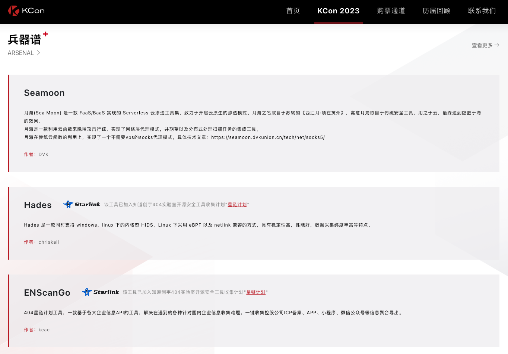
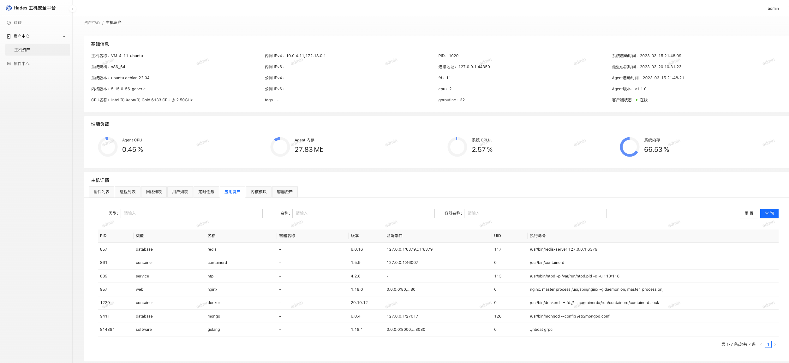
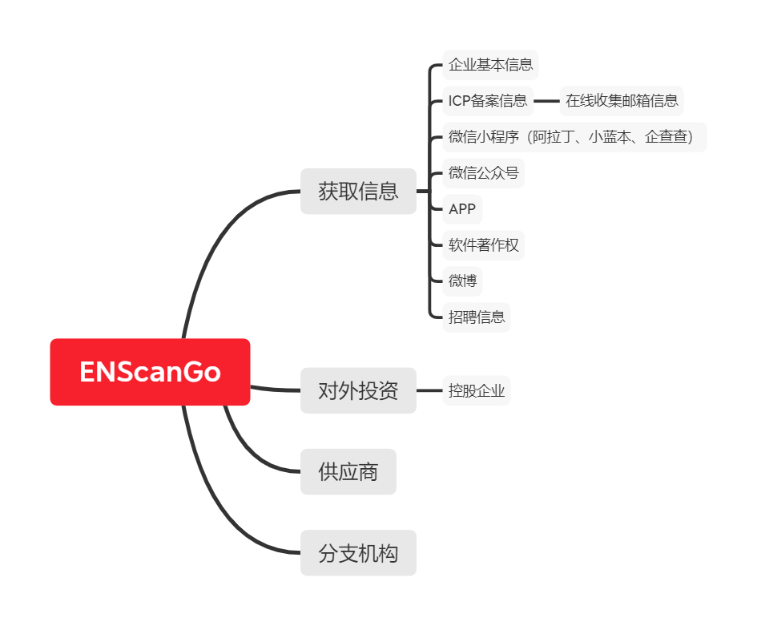
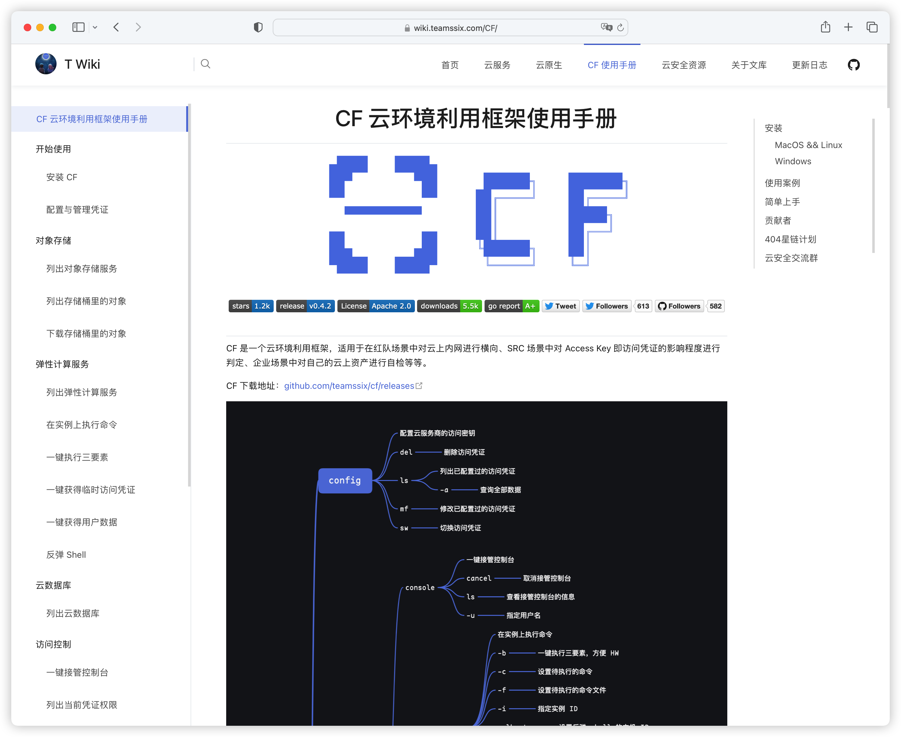

## 入选2023KCon黑客大会兵器谱

KCon大会，国际网络安全圈富有活力与影响力的前沿网络安全攻防技术交流平台，以“追求干货有趣”为宗旨，力求为网安技术研究者们打造一个尽情展示、尽情交流的创意舞台，期待以技术之力引领业界未来的变革。

在数字化浪潮奔腾汹涌的当下，数字的汇聚引起AI的“智变”，也引起了更多值得被关注的网络安全风险。安全是发展的前提，网络安全技术的创新与进步是数字中国建设的重要支撑。

因此，本届KCon大会着眼数智时代的网安风险，以 **“归源·智变”** 为主题，意在以技术初心凝聚行业之力，为护航数智时代的安全发展贡献绵薄之力。

详情访问：[KCon 2023 - KCon 黑客大会](https://kcon.knownsec.com/list-kcon2023.html)

网络空间的实战攻防离不开各类自动化工具的运用。这些工具就如同网安战场上的“兵器”，可以为安全人员进行“全副武装”，帮助展示及处理诸多复杂、耗时的安全问题，明确风险、提升效率、加强防御。

AI大模型的横空出世，带来了新一轮技术工具的进化热潮，网络安全行业也纷纷跟进。KCon一直聚焦当下前沿的研究方向与工具技术，「兵器谱」展示环节便是为了鼓励国内安全自动化工具发展而设立。

在KCon 2023的大会现场，10件由大众评选出的安全神兵利器将同台亮相展区，等待大家的探索。“锻造”出这些“兵器”的网安巧匠也将在展示区为大家讲解演示，传授使用“秘籍”。

其中有 3 个项目来自404星链计划，他们分别是：

- Hades
- ENScanGo
- CF

>排名不分先后

### [Hades](https://github.com/knownsec/404StarLink/blob/master/detail/Hades.md)

https://github.com/theSecHunter/Hades

Hades 是一款支持 Windows/Linux 的内核级别数据采集主机入侵检测系统，其中每个插件均可独立分开运行。

### [ENScanGo](https://github.com/knownsec/404StarLink/blob/master/detail/ENScanGo.md)

https://github.com/wgpsec/ENScan_GO

剑指HW/SRC，解决在HW/SRC场景下遇到的各种针对国内企业信息收集难题。

### [CF](https://github.com/knownsec/404StarLink/blob/master/detail/cf.md)

https://github.com/teamssix/cf

CF 是一个云环境利用框架，适用于在红队场景中对云上内网进行横向、SRC 场景中对 Access Key 即访问凭证的影响程度进行判定、企业场景中对自己的云上资产进行自检等等。

