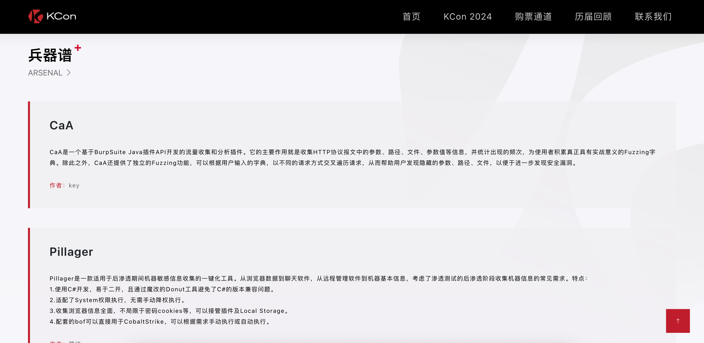
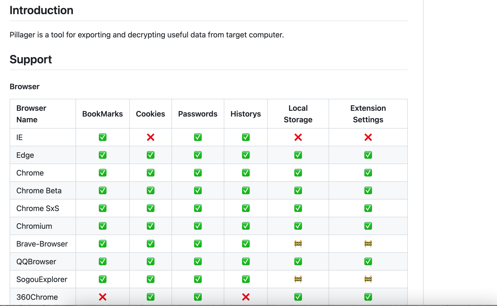
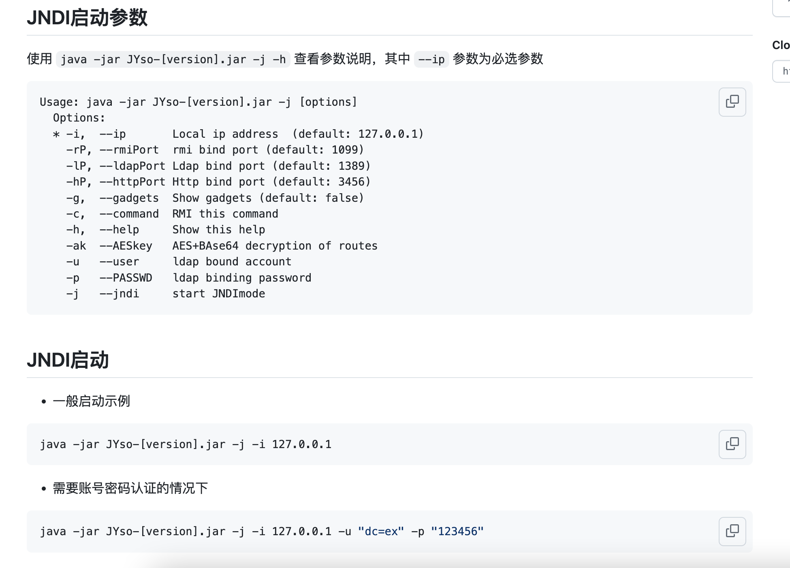

## 入选2024KCon黑客大会兵器谱

KCon 黑客大会，知道创宇出品，始终秉承“追求干货、有趣”的理念，打造开放的网络安全攻防技术交流平台，“汇聚全球黑客的智慧”是 KCon 黑客大会的一贯宗旨。

本次大会，我们将如鹰击长空般探索人工智能在网络安全中的无限可能，揭开其神秘面纱，共享技术突破带来的绚烂光芒；本次大会，我们将汇聚全球黑客的智慧如百川归海，见证新质生产力如雨后春笋般崛起，为网络安全的未来绘制宏伟蓝图；本次大会，我们将凝聚十三载的辉煌成果，以归零的勇气和决心，再次踏上“技术突破如破竹、边界探索似探险、安全极致胜巅峰”的崭新征程，共同书写网络安全的新篇章！

本届大会以 **“同道”** 为主题，汇聚了网络安全领域的精英与志同道合之士，共谋网络安全之道，携手开创行业未来发展蓝图。

详情访问：[KCon 2024 - KCon 黑客大会](https://kcon.knownsec.com/list-kcon2024.html)

为了鼓励国内安全自动化工具的发展，展示更多安全人员们的安全自动化研究成果，自2016年起，KCon黑客大会便引入「兵器谱」展示环节。

过去几届 KCon 黑客大会现场，已有七十多件“安全神兵利器”受到千余名参会者的观摩与试用，并获得媒体朋友们的广泛关注。

今年，我们为大家精心挑选出了7件安全江湖的“神兵利器”，将于KCon舞台尽情探索与展示！

其中有 2 个项目来自404星链计划，他们分别是：

- [Pillager](https://github.com/qwqdanchun/Pillager)
- [JYso](https://github.com/qi4L/JYso)

>排名不分先后

### [Pillager](https://github.com/knownsec/404StarLink/blob/master/detail/Pillager.md)

https://github.com/qwqdanchun/Pillager

Pillager是一个适用于后渗透期间的信息收集工具，可以收集目标机器上敏感信息，方便下一步渗透工作的进行。

### [JYso](https://github.com/knownsec/404StarLink/blob/master/detail/JYso.md)

https://github.com/qi4L/JYso

JYso 是一款可以同时当做 ysoserial 与 JNDIExploit 使用的工具，同时具备多种 JNDI 高版本、WAF、RASP 的 Bypass 功能。

